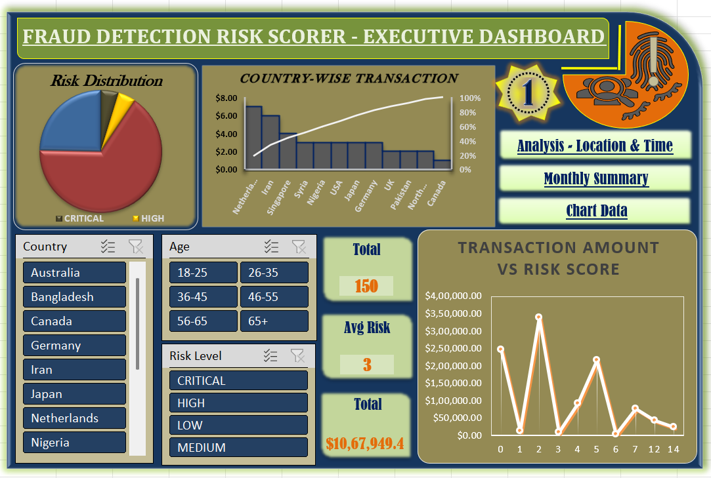

# Fraud Detection Risk Scorer

## 1. Project Overview

The **Fraud Detection Risk Scorer** project is designed to automate the identification and assessment of potentially fraudulent financial transactions. By leveraging predefined rules and analytical techniques, the system assigns a **risk score** to each transaction, enabling organizations to efficiently detect, prioritize, and investigate suspicious activities.

---

## 2. Data Description

**Data File:** `Fraud_Detection_Risk_Scorer.xlsx`

### Data Source

The dataset is sourced from financial transaction records, typically exported from a banking system, payment gateway, or transactional database. The Excel file contains multiple sheets for raw data, analysis, summaries, and user instructions.

### Data Volume

The solution is designed to handle **large volumes of transaction data**, as commonly encountered in financial fraud detection scenarios.

### Data Fields

Key data fields include:

* Transaction ID
* Transaction Date & Time
* Transaction Amount
* Location / Country
* Account or User ID
* Transaction Type
* Risk Score
* Risk Level (Low, Medium, High, Critical)
* Risk Flags (e.g., high amount, unusual time, high-risk country)

### Data Cleaning

The following data cleaning steps are applied:

* Removal of duplicate records
* Handling missing or incomplete values
* Standardization of date, amount, and location formats
* Filtering out irrelevant or test transactions

---

## 3. Target Audience

* **Fraud Analysts** – To investigate flagged transactions
* **Risk Management Teams** – To monitor fraud patterns and trends
* **Compliance Officers** – To support regulatory and audit requirements
* **Executives / Managers** – For high-level insights through dashboards

---

## 4. Key Features

* **Automated Risk Scoring** – Assigns a score to each transaction based on defined rules
* **Risk Categorization** – Classifies transactions into Low, Medium, High, or Critical risk levels
* **Executive Dashboard** – Visual representation of key metrics and fraud trends
* **Detailed Analysis Sheets** – Drill-down analysis by time, location, and monthly patterns
* **User Instructions** – Clear guidance for using and interpreting the tool

---

## 5. Tools and Techniques

* **Microsoft Excel** – Primary tool for analysis
* **Excel Formulas & Logic Rules** – Used for risk scoring and categorization
* **Pivot Tables & Charts** – For summary statistics and visual analysis
* **Conditional Formatting** – Highlights high-risk transactions
* **Data Validation** – Ensures data consistency and accuracy

---

## 6. Project Scope and Limitations

### Scope

* Rule-based fraud detection for financial transactions
* Summary-level and detailed transaction analysis in a single file
* Designed for use by non-technical users

### Limitations

* Rule-based logic may not detect new or complex fraud patterns
* Dependent on data quality and completeness
* No real-time transaction monitoring
* Limited to Excel’s analytical capabilities (no machine learning or AI)

---

## 7. Outcome / Expected Results

* Faster identification of suspicious transactions
* Improved visibility into fraud risks and trends
* Actionable insights for investigation and resolution
* Support for compliance, reporting, and audits

---

## 8. Future Enhancements

* Integration of **machine learning models** for predictive fraud detection
* **Real-time monitoring** with live transaction feeds
* **Automated alerts** for high and critical risk cases
* Analyst feedback loop to reduce false positives
* Integration with **external data sources** (blacklists, customer profiles)

---

## Dashboard Screenshot

Below is a snapshot of the **Fraud Detection Risk Scorer – Executive Dashboard**, showcasing risk distribution, country-wise transactions, KPIs, filters, and transaction amount vs risk score analysis.

---

## Author

**Aloshiya Mishra**

* Mail: [mishraaloshiya@gmail.com)
* GitHub: [https://github.com/aloshiyamishra](https://github.com/aloshiyamishra)
* LinkedIn: [https://www.linkedin.com/in/aloshiya-mishra-9a5571244](https://www.linkedin.com/in/aloshiya-mishra-9a5571244)
